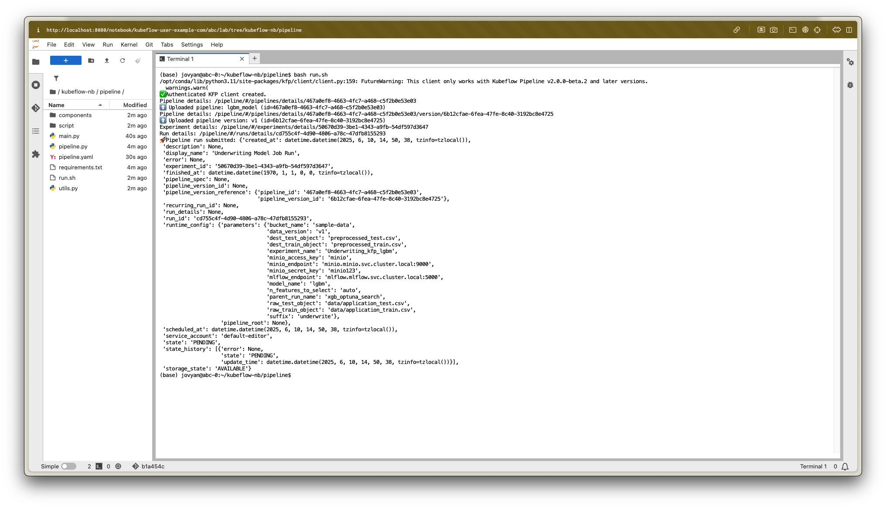
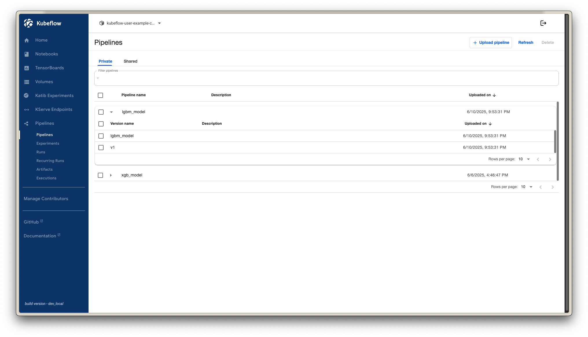
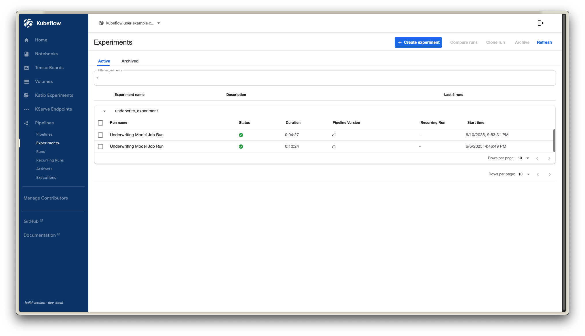
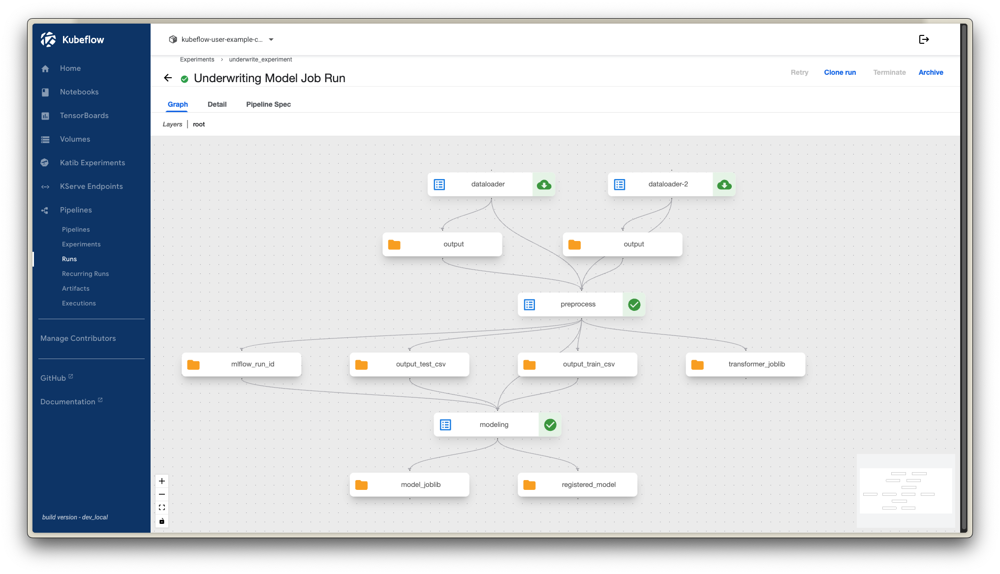

# Using Kubeflow Notebook

## 📌 Contents
- [Introduction](#introduction)
- [Repository Structure](#repository-structure)
- [Prerequisites Installation](#prerequisites-installation)
- [Usage](#usage)

---

## 🧩 Introduction
This repository is designed to be used inside a Kubeflow Notebook. Its main purpose is to demonstrate how to use Kubeflow Notebooks and execute basic Kubeflow Pipelines (KFP) within it.

---

## 📁 Repository Structure

```text
kubeflow-nb/
├── requirements.txt
├── README.md
├── LICENSE
├── data/                                
│   └── processed/
│       ├── train/
│       │   └── processed_train_v1.csv
│       └── test/
│           └── processed_test_v1.csv
├── pipeline/
│   ├── scripts/
│   │   ├── dataloader.py
│   │   ├── modeling.py
│   │   └── preprocess.py
│   ├── components/
│   │   ├── dataloader.yaml
│   │   ├── modeling.yaml
│   │   └── preprocess.yaml
│   ├── main.py
│   ├── pipeline.py
│   ├── pipeline.yaml
│   ├── utils.py
│   └── run.sh
└── notebook/
    ├── modeling.ipynb
    └── eda.ipynb
```

---

## ⚙️ Prerequisites Installation

Please refer to the Kubeflow platform setup documented in my other repository:  
🔗 [An-end-to-end-MLops-with-Kubeflow](https://github.com/dohuyduc2002/An-end-to-end-MLops-with-Kubeflow)

### ✅ Enable Notebook to Run KFP
When creating a namespace in Kubeflow, check the **"tickbox"** to allow Notebooks to access KFP.


### 🛠 Git Configuration in Notebook

By default, Kubeflow Notebooks have Git installed. To enable Git operations, configure your GitHub credentials as follows:

1. **Generate a GitHub personal access token:**  
   🔗 [https://github.com/settings/tokens](https://github.com/settings/tokens)

2. **Configure Git in Kubeflow Notebook terminal:**

```bash
git config --global user.name "Your Name"
git config --global user.email "you@example.com"
```

3. **Create remote workspace:**
In this notebook, I'm using github as the remote workspace is `github.com/dohuyduc2002/kubeflow-nb.git` . You can create a new repository on GitHub and set it as the remote origin for this project. After creating the repository, run the following command in the Kubeflow Notebook terminal:

```bash
git remote set-url origin https://<github_username>:<access_token>@github.com/dohuyduc2002/kubeflow-nb.git
```

---

## 📝 Usage

The Notebook image used for this project is:  
**`microwave1005/scipy-img:v0.1`** — a custom image prebuilt with all required dependencies.

In this note book, I have created two Jupyter Notebooks for research tasks in EDA and modeling with the downstream folder of this task is `data/processed/`. Feel free to modify the code in the Notebooks as needed

## 🚀 Schedule One-off run in Kubeflow 
1. Set up environment variables
The Jupyter Notebooks is not allow to create `dot` file, so open terminal in Kubeflow Notebook and run the following command to create a `.env` file in pipeline folder

```bash
nano .env
```
Then add the following content to the `.env` file:
```
# MinIO configuration
MINIO_ENDPOINT=minio.minio.svc.cluster.local:9000
MINIO_ACCESS_KEY=minio
MINIO_SECRET_KEY=minio123
MINIO_BUCKET_NAME=sample-data

MLFLOW_ENDPOINT=mlflow.mlflow.svc.cluster.local:5000
KFP_NAMESPACE='kubeflow-user-exmaple-com'
```

Press `CTRL + X`, then `Y`, and finally `Enter` to save the file.

2. Running the pipeline
a. Components
There are 3 components in this pipeline:
- `data_loader`: This component is used to load data from Minio bucket

- `preprocess`: In this component, I have implemented a preprocessing and feature selection pipeline and then upload joblib to Mlflow as a parent run, the preprocessed data is uploaded into Minio bucket `sample-data` and Kubeflow pipeline artifact store. The preprocessing steps are:
  - get list of categorical features and numerical features from the data
  - exclude features if missing ratio is greater than 10%
  - bins high cardinality and low cardinality features
  - exclude features again using IV scrore threshold from 0.02 to 0.05
  - auto binning again with `optbinning` library to minimize curse of dimensionality for high cardinality features
  - feature selection using ANOVA F-test as a scoring function

- `modeling`: This component is used to train the model using XGBoost, LightGBM through optuna trial. All the optuna trials is uploaded to Mlflow as a child run of the parent run. After all trials are finished, the `best_trial` is selected and `registered` to Mlflow model registry. 

b. Submit the pipeline
In my `main.py`, the pipeline is submitted to Kubeflow as a one-off run under the pipeline and experiment name. The recurring run will be activated through the CICD step. 

To run the pipeline, you can use the following command:
```bash
bash run.sh
```


This run will create an experiment named `underwrite-experiment` and a pipeline named `lgbm-model` with 2 version base is `lgbm-model` and `v1`. The pipeline will be executed with the components defined in the `pipeline/components/` directory.




You can monitor the job run in the Kubeflow Pipelines UI.

